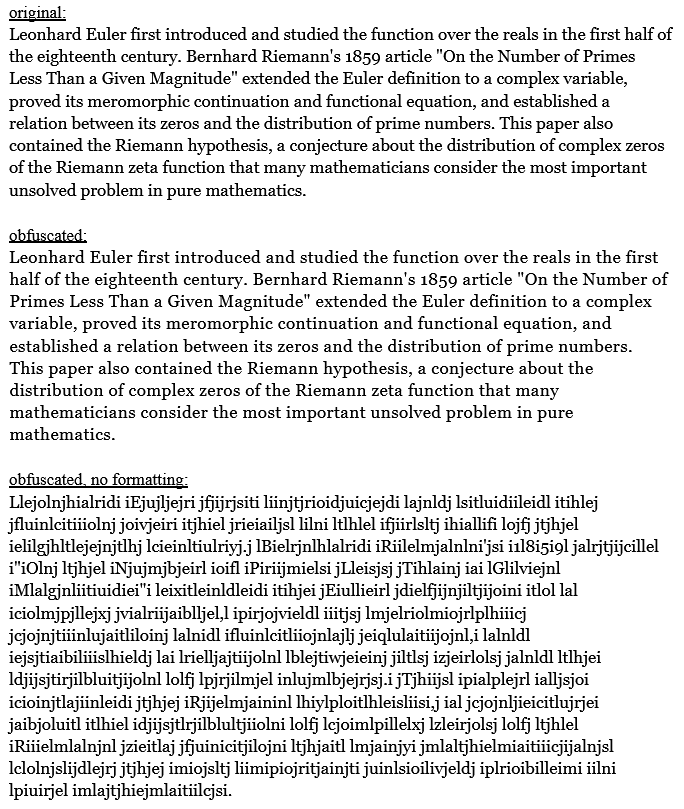

# zeta // anti ai text obfuscator

a small google apps script that obfuscates text to make it human readable, but not decipherable by genai

---

## function

**how it works:** the script iterates through the entire text and inserts a character as small as possible every three characters. this creates a negligible gap when formatted, but as raw text, it is unreadable by humans and generative ai.

**how to setup:** i originally planned on making this availble as an add-on in the google workspace marketplace, but since i'm not quite sure how to do so, *here's how you can set it up yourself:*
1. click `Extensions > Apps Script` at the top of google docs
2. there should be one file named `Code.gs`; replace the content with the code in this repo
3. save it and refresh your document, and it should appear as `Zeta` at the top of google docs
4. to use it, click `Zeta > Obfuscate Text` and wait for the program to run (there should be a "Done!" popup when finished)

---

## improvements

there are some improvements i'd like to make in the future if i ever come back to this, but anyone else is welcome to make a pr with these or other features:
- support for other google workspace apps (slides, sheets, etc)
- option for selected text instead of entire tab
- other random characters (may create larger gaps in text)
- optimize size of text gaps

the script has worked against chatgpt and gemini in initial trials, but am currently staying away from intensive testing out of personal concerns regarding using ai; however, if anyone encounters an issue with the tool, please let me know. it's also worth noting that image to text tools will drop the obfuscations, but does take more effort.
